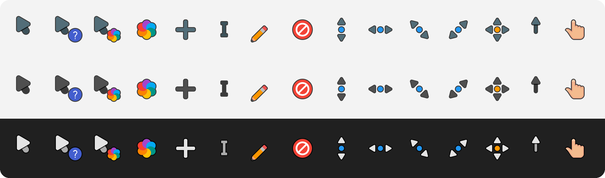

<div align="center">

# Material Cursors for Windows

**Material Cursors by varlesh for Windows 11, rendered from the original vector artwork at every size Windows picks
for your display scale and pointer size.**

[](https://github.com/hervad/material-cursors-w11-hidpi/releases/latest)
[](#install)
[](LICENSE)



</div>

## Install

1. **Download** the zip for your variant from the [latest release](https://github.com/hervad/material-cursors-w11-hidpi/releases/latest)
   and extract it.
2. **Right-click** `install.inf` in the extracted folder and choose **Install**, then approve the administrator prompt.
   On Windows 11, **Install** is under **Show more options**.
3. **Apply:** Mouse Properties may open by itself; if it doesn't, press <kbd>Win</kbd>+<kbd>R</kbd> and run `main.cpl`.
   On the **Pointers** tab, pick the scheme and click **OK**.

If Windows ever shows a different scheme after you change the pointer size, pick Material again in `main.cpl`.

## Pick a variant

| | Default | Dark | Light |
| --- | --- | --- | --- |
| **Look** | Blue-grey | Dark grey | White |
| **Zip** | `material-default-w11-hidpi-v….zip` | `material-dark-w11-hidpi-v….zip` | `material-light-w11-hidpi-v….zip` |
| **Scheme name** | Material W11 HiDPI | Material Dark W11 HiDPI | Material Light W11 HiDPI |

These are the three variants on the original theme page. All of them have a dark outline, so each stays visible on
any background. Install all three and switch whenever you like.

## Why they stay sharp

Windows doesn't scale cursors smoothly. It takes the pointer size from **Settings › Accessibility › Mouse pointer
and touch** (size 1 = 32 px, each step adds 16 px), multiplies it by a factor that depends on your display scale,
and then looks for an image of exactly that size inside the cursor file. If the file doesn't have it, Windows
resamples the nearest one, and resampling blurs.

Every cursor here contains each of those sizes, rendered from the original vector artwork, never resampled:

| Display scale | Pointer size 1 | Size 2 | Size 3 | Size 4 | Size 5 | |
| --- | :-: | :-: | :-: | :-: | :-: | --- |
| 100–149 % | 32 px | 48 px | 64 px | 80 px | 96 px | measured |
| 150–199 % | 48 px | 72 px | 96 px | 120 px | 144 px | measured |
| 200–249 % | 64 px | 96 px | 128 px | 160 px | 192 px | assumed |
| 250–299 % | 80 px | 120 px | 160 px | 200 px | 240 px | assumed |
| 300 %+ | 96 px | 144 px | 192 px | 240 px | 256 px | assumed |

The two **measured** rows come from a size probe on Windows 11 25H2 (build 26200), where the factor is 1.0 from
100 % to 149 % and 1.5 from 150 % to 199 %. The **assumed** rows continue that pattern; they couldn't be measured
on the test screen, so the files simply include those sizes as well. Larger pointer sizes follow the same rule,
up to Windows' 256 px maximum.

- **Static cursors** are exact for every pointer size in every row.
- **Busy and working** (animated) are exact for pointer sizes 1–5 at 100–149 % and 150–199 %. Elsewhere Windows
  resizes the closest image. Animated files carry fewer sizes because the Windows loader limits how large each
  animation frame may be.
- **At 125 % and 175 %** some softness is normal and can't be fixed by any cursor theme: Windows uses the 100 % or
  150 % image there and stretches it to fit.

The original theme also ships a Windows set of its own; it has one 32 px image per cursor, so Windows resamples it
at every other pointer size and display scale.

**No performance cost.** Windows decodes a cursor once, when you switch scheme or pointer size, and animation only
flips between images it has already decoded. Measured on Windows 11 25H2 against Microsoft's own `aero` cursors
(same machine, same run):

| | Material | Windows aero |
| --- | --- | --- |
| Load a static cursor (32–96 px) | 0.4–0.6 ms | 0.3–0.8 ms |
| Load an animated cursor (32–96 px) | 5–11 ms | 3–13 ms |
| Load an animated cursor (256 px) | 87 ms | 59 ms |
| GDI / USER handles left behind after 300 loads | 0 / 0 | 0 / 0 |

Before every release, GitHub Actions loads every file with the real Windows cursor loader at several sizes; a
failure blocks the release.

## What's included

- **All 17 Windows pointer roles:** normal, help, working in background, busy, precision, text, handwriting,
  unavailable, 4 resize directions, move, alternate, link, location and person select.
  Location and person select use the pointing hand (Material has no artwork for them; Windows' own versions are
  hand variants too).
- **Animated busy and working cursors:** 24 frames per turn, as in the original theme.
- **Hotspots** from the original theme, scaled to every size; centred cursors use the exact centre of the drawing.
- `install.inf` and `uninstall.cmd` for each variant, plus the license file.

## Tips

- **Shadow:** the original theme drew a soft shadow into each image. Windows draws its own, so it isn't baked in
  here. For the closest look, turn on **Settings › Accessibility › Mouse pointer and touch › Enable mouse pointer shadow**.
- **Animation speed:** the original runs at 30 ms per frame. Windows counts animation time in 1/60 s steps, so the
  frames mix 33 ms and 17 ms steps: one turn takes 717 ms instead of 720 ms.

## Uninstall

1. Run `uninstall.cmd` from the extracted folder. It removes the scheme from the list and opens Mouse Properties.
2. Pick another scheme and click **OK**.
3. Delete the cursor files from an administrator PowerShell, for example:

```powershell
Remove-Item "C:\Windows\Cursors\Material W11 HiDPI" -Recurse
```

## Build from source

The cursors are built with [w11-cursor-toolkit](https://github.com/hervad/w11-cursor-toolkit) from the original
repository, pinned as a git submodule in [`upstream/`](upstream/). Rendering needs the native cairo library; see the
toolkit's README for how to get it on Windows or Linux.

```powershell
git clone --recurse-submodules https://github.com/hervad/material-cursors-w11-hidpi
cd material-cursors-w11-hidpi
python -m pip install "w11cursor @ git+https://github.com/hervad/w11-cursor-toolkit@v0.2.0"
w11cursor build    theme.toml --out dist      # all three variants + zips
w11cursor validate theme.toml --dist dist     # re-read every file: sizes, hotspots, frames, timing
w11cursor preview  theme.toml --dist dist     # redraw docs/preview.png
```

Releases are built by GitHub Actions from a version tag; a local build can differ by a few antialiasing pixels.
How each cursor maps to the original files is described in [`theme.toml`](theme.toml) and
[`PORT_STATUS.md`](PORT_STATUS.md).

## Credits

The artwork is [Material Cursors](https://github.com/varlesh/material-cursors) by Alexey Varfolomeev (varlesh),
also on [gnome-look](https://www.gnome-look.org/p/1346778). This project only packages it for Windows.
See [CREDITS.md](CREDITS.md) for every change from the original.

Licensed under the GNU GPL v2.0, like the original: see [LICENSE](LICENSE).
